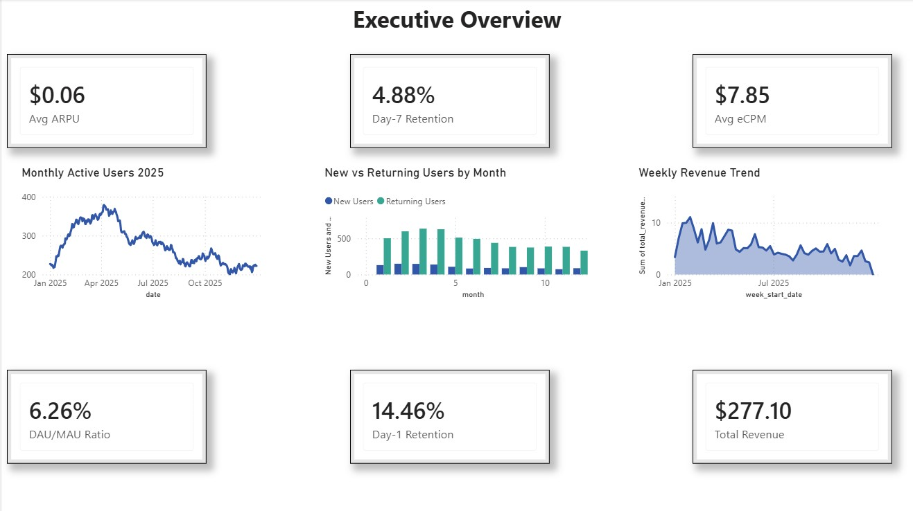
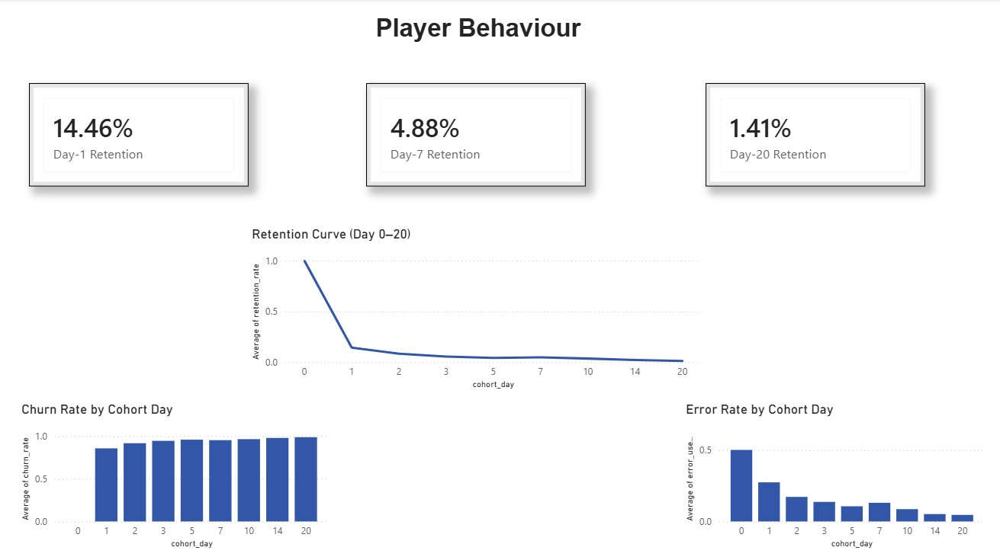
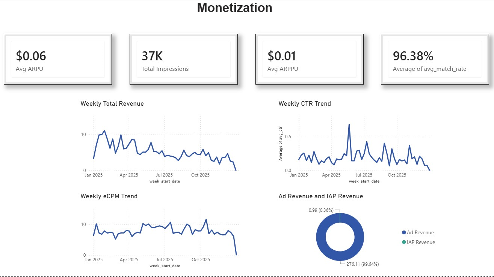
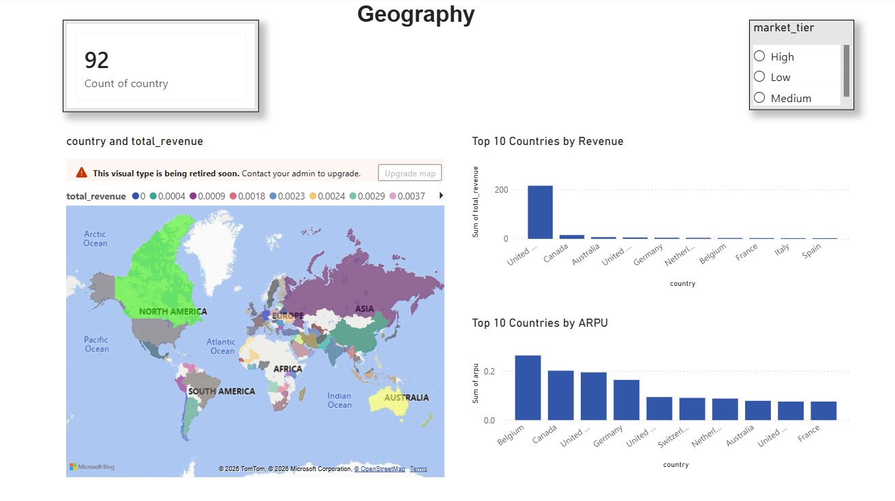
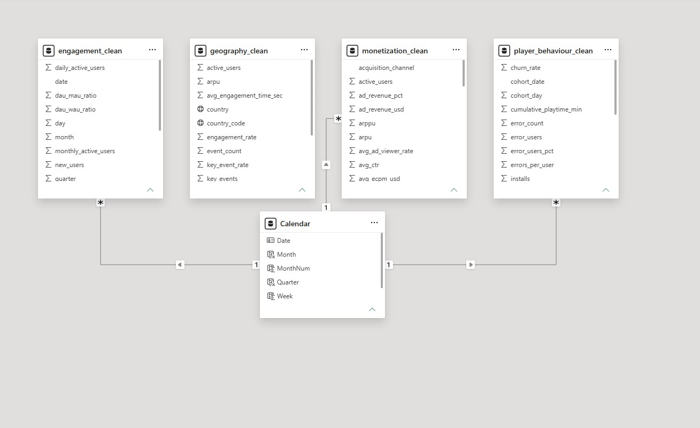

# Mobile Game Analytics: Player Behaviour, Retention & Monetization

An end-to-end data analytics and Power BI project focused on understanding how players engage with a mobile game, how long they stay, how the game generates revenue, and how performance varies across markets.

## About the Project

This project was developed as a business intelligence solution for a confidential mobile game publisher.

The goal was to bring together data from multiple analytics sources and turn it into a more useful view of overall game performance.

The analysis focuses on four main areas:

- Player engagement
- Player retention and churn
- Monetization and advertising performance
- Geographic performance

I used Python to prepare and validate the data, then built an interactive Power BI dashboard to explore the results and identify useful business insights.

## What I Worked On

The project followed a simple analytics workflow:

**Data Sources → Python → Data Preparation → Power BI → DAX → Dashboard → Business Insights**

### Data Preparation

The project started with exported CSV data from Firebase Analytics, GameAnalytics, and Google AdMob.

Using Python, pandas, and NumPy, I:

- Inspected the datasets and their structure
- Checked for duplicate records
- Checked for missing values
- Standardized date fields
- Reviewed data consistency
- Created additional analytical fields
- Calculated ARPU and returning-user percentage
- Created revenue-based market tiers
- Prepared four analysis-ready datasets

The final datasets covered:

- Engagement
- Player Behaviour
- Monetization
- Geography

## Power BI Dashboard

The Power BI dashboard is organized into four pages.

### 1. Executive Overview

Provides a high-level view of game performance using KPIs and trends such as:

- ARPU
- Day-1 and Day-7 retention
- DAU/MAU ratio
- eCPM
- Total revenue
- Monthly active users
- New vs. returning users
- Weekly revenue

### 2. Player Behaviour

Focuses on player retention and churn across install cohorts.

It includes:

- Day-1 retention
- Day-7 retention
- Day-20 retention
- Retention curve
- Churn rate
- Error rate by cohort day

### 3. Monetization

Looks at how the game generates revenue and how effectively advertising performs.

The dashboard includes:

- ARPU
- ARPPU
- Ad impressions
- Match rate
- CTR
- eCPM
- Weekly revenue
- Advertising vs. in-app purchase revenue

### 4. Geography

Explores performance across different countries and market tiers.

It includes:

- Countries represented
- Revenue by country
- ARPU by country
- Top 10 countries
- Revenue-based market tiers
- Interactive filtering

## Key Findings

The dashboard highlighted several areas worth investigating further.

### Player Engagement

DAU/MAU showed a gradual decline during the year, indicating that overall player stickiness was weakening over time.

### Retention

The largest player drop-off occurred immediately after installation. Day-1 churn was approximately **85.5%**, making early player experience an important area for improvement.

### Monetization

The game was heavily dependent on advertising, with approximately **99.6% of revenue coming from ads** in the analyzed data.

### Geography

Revenue per player varied across countries. Comparing revenue with active users helped identify markets where player volume and monetization performance did not necessarily move together.

## Power BI Data Model

The four datasets have different levels of detail, including daily, weekly, cohort-day, and country-level data.

To avoid creating incorrect relationships between unrelated tables, I used a shared Calendar dimension to support consistent date-based filtering across the model.

The dashboard is powered by DAX measures for metrics including:

- Total Revenue
- Average ARPU
- Average ARPPU
- Average eCPM
- Ad Revenue %
- DAU/MAU Ratio
- Day-1 Retention
- Day-7 Retention
- Day-20 Retention
- Churn Rate

## Tools Used

**Data Preparation**
- Python
- Pandas
- NumPy
- Jupyter Notebook

**Business Intelligence**
- Microsoft Power BI
- DAX

**Data Sources**
- Firebase Analytics
- GameAnalytics
- Google AdMob

# Dataset Information

The original datasets used in this project are not included in this repository because they contain project-specific business data.

The analysis was performed using aggregated data from Firebase Analytics, GameAnalytics, and Google AdMob.

The project uses four analysis-ready datasets:

- Engagement
- Player Behaviour
- Monetization
- Geography

The repository includes the methodology, dashboard screenshots, Power BI data model, and project report to demonstrate the complete analytics workflow.
